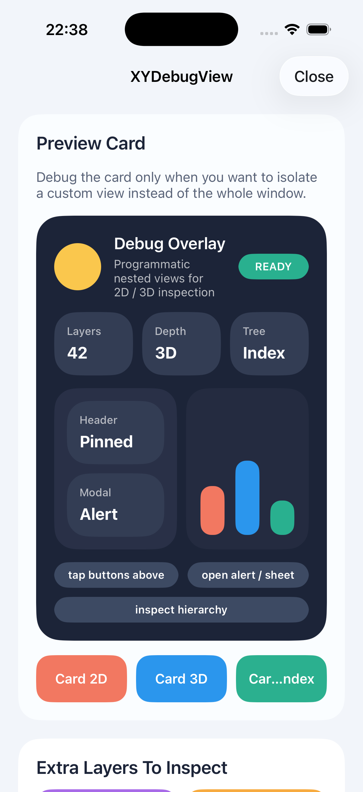
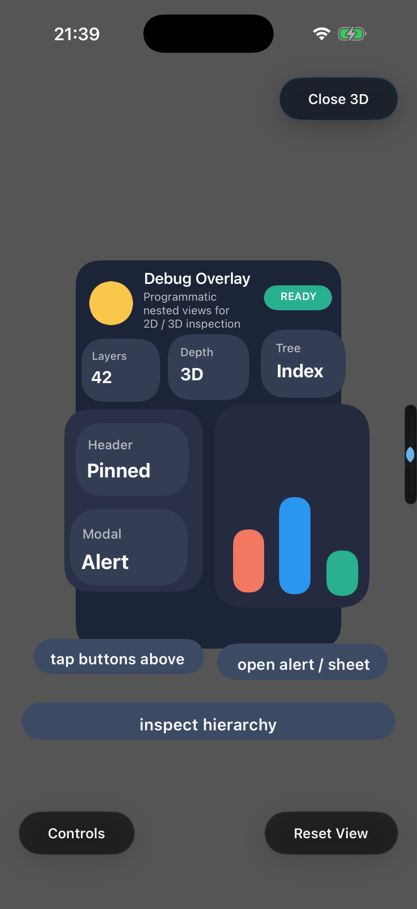
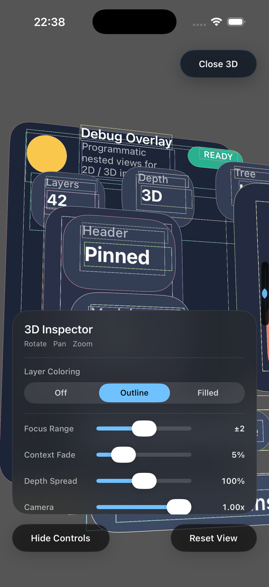

# XYDebugView

`XYDebugView` is a lightweight UIKit hierarchy debugger with:

- `2D` frame inspection
- `3D` exploded layer inspection
- layer focus and coloring controls
- index tree browsing for the current window or a specific view

## Demo

The demo app is a pure-code sample generated from [`Demo/project.yml`](Demo/project.yml) and integrated through a local development pod.

| Home | 3D Card | 3D Card Controls |
| --- | --- | --- |
|  |  |  |

## Installation

`XYDebugView` is available through CocoaPods.

```ruby
pod 'XYDebugView', '~> 2.0.0'
```

## Usage

```objective-c
#import <XYDebugView/XYDebugViewManager.h>
```

### Open Debugging

```objective-c
// Debug the current key window in 2D.
[[XYDebugViewManager sharedInstance] showDebug];

// Debug the current key window in a specific style.
[[XYDebugViewManager sharedInstance] showDebugStyle:XYDebugStyle3D];

// Debug a specific view in 2D / 3D / Index mode.
[[XYDebugViewManager sharedInstance] showDebugView:view withDebugStyle:XYDebugStyle3D];
```

### Close Debugging

```objective-c
[[XYDebugViewManager sharedInstance] closeDebug];
```

## 3D Controls

The 3D inspector currently supports:

- `Layer Coloring`: `Off`, `Outline`, `Filled`
- `Focus Range`: how many neighboring layers remain visible while focused
- `Context Fade`: minimum opacity for non-focused layers
- `Depth Spread`: z-spacing between cloned layers
- `Camera`: scene perspective strength

The focus ruler stays pinned to the right edge and expands on touch-down, then resets back to `All Layers` shortly after touch-up.

## Demo Setup

```bash
brew install xcodegen
./scripts/bootstrap_demo.sh
open Demo/XYDebugViewDemo.xcworkspace
```

There is also a double-click launcher at [`GenerateDemo.command`](GenerateDemo.command).

## Refresh Demo Screenshots

```bash
./scripts/capture_demo_screenshots.sh
```

That script:

- regenerates the demo project
- builds the app for the simulator
- launches capture scenarios
- writes screenshots into [`docs/images`](docs/images)

## Notes

- The demo app adopts the modern `UIScene` lifecycle.
- The demo is intentionally pure-code so the repository only keeps pod logic, demo logic, and generation config.

## Author

XcodeYang, xcodeyang@gmail.com

## License

`XYDebugView` is available under the MIT license. See [LICENSE](LICENSE).
